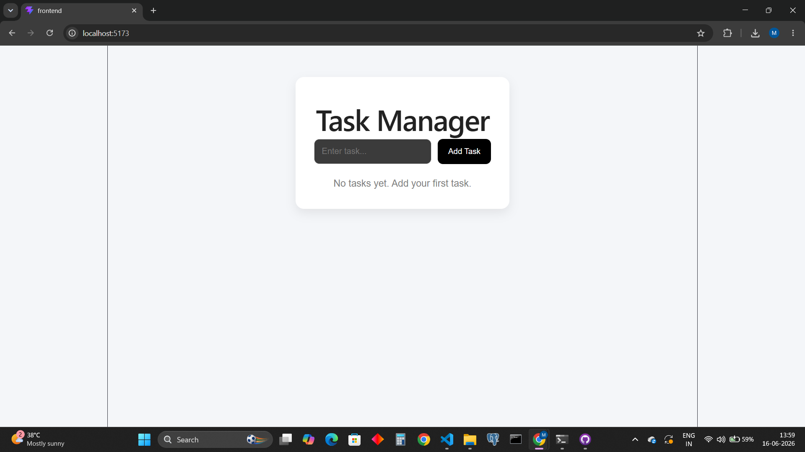
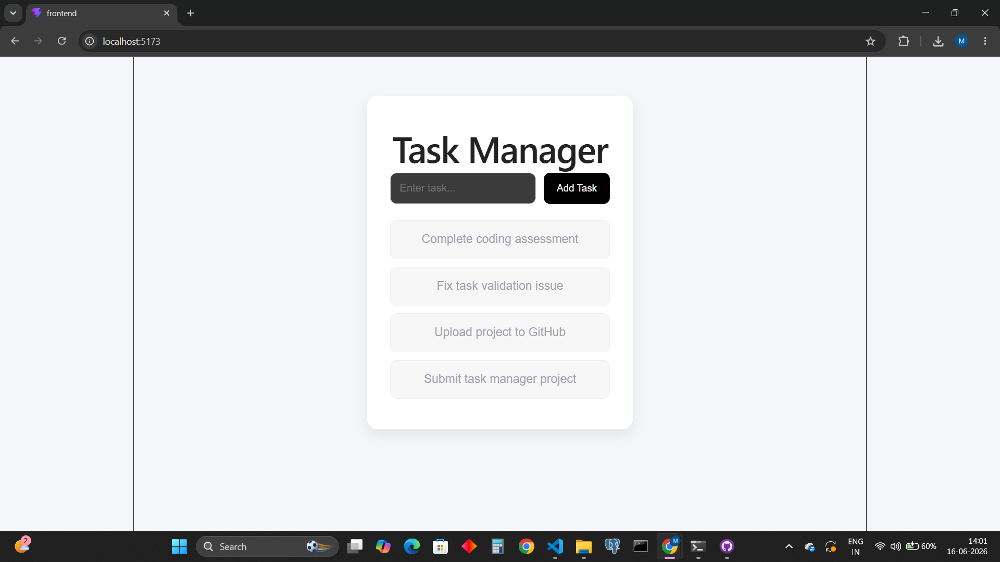

# Task Manager Application

A lightweight Full-Stack Task Manager application built using **React**, **Node.js**, and **Express**, with **JSON file storage** for task persistence.

## Overview

This project allows users to:

* View all tasks
* Add new tasks
* Persist tasks using a local `tasks.json` file
* Update the UI dynamically without refreshing the page

---

## Tech Stack

### Frontend

* React (Vite)
* Axios
* CSS

### Backend

* Node.js
* Express.js
* UUID
* CORS

### Storage

* Local JSON file (`tasks.json`)

---

## Project Structure

```txt
task-manager-assessment/
│── backend/
│   ├── server.js
│   ├── tasks.json
│   ├── package.json
│
│── frontend/
│   ├── src/
│   ├── public/
│   ├── package.json
│
│── README.md
│── .gitignore
```

---

## Prerequisites

Please ensure the following are installed on your system:

* Node.js
* npm (comes with Node.js)

Verify installation:

```bash
node -v
npm -v
```

---

## Installation & Setup

### 1. Clone the Repository

```bash
git clone <your-github-repository-url>
cd task-manager-assessment
```

---

## Backend Setup

Open terminal and run:

```bash
cd backend
npm install
npm run dev
```

Backend server runs at:

```txt
http://localhost:5000
```

### Available API Endpoints

#### Get All Tasks

```http
GET /api/tasks
```

Returns all tasks from `tasks.json`.

#### Add New Task

```http
POST /api/tasks
```

Request Body:

```json
{
  "title": "Complete coding assessment"
}
```

Response Example:

```json
{
  "id": "12345",
  "title": "Complete coding assessment",
  "isCompleted": false,
  "createdAt": "2026-06-16T10:30:00.000Z"
}
```

---

## Frontend Setup

Open another terminal and run:

```bash
cd frontend
npm install
npm run dev
```

Frontend runs at:

```txt
http://localhost:5173
```

---

## Features

* Display task list on page load
* Add new task
* Dynamic UI update without refresh
* Persistent local JSON storage
* Responsive and clean user interface

---

## Dependencies

### Backend

```bash
express
cors
uuid
nodemon
```

### Frontend

```bash
react
axios
vite
```

---

## Notes

* No external database is used.
* Task data is stored locally in `tasks.json`.
* State synchronization is handled using React hooks (`useState`, `useEffect`).

---

## Application Screenshots

### Empty State



### Task Added State



## Author

**Muthupandi**
